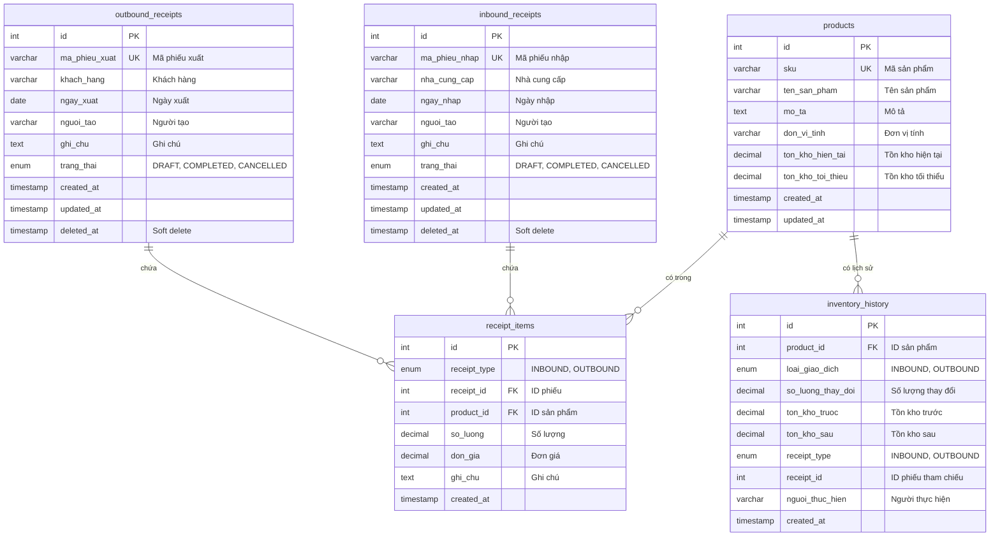
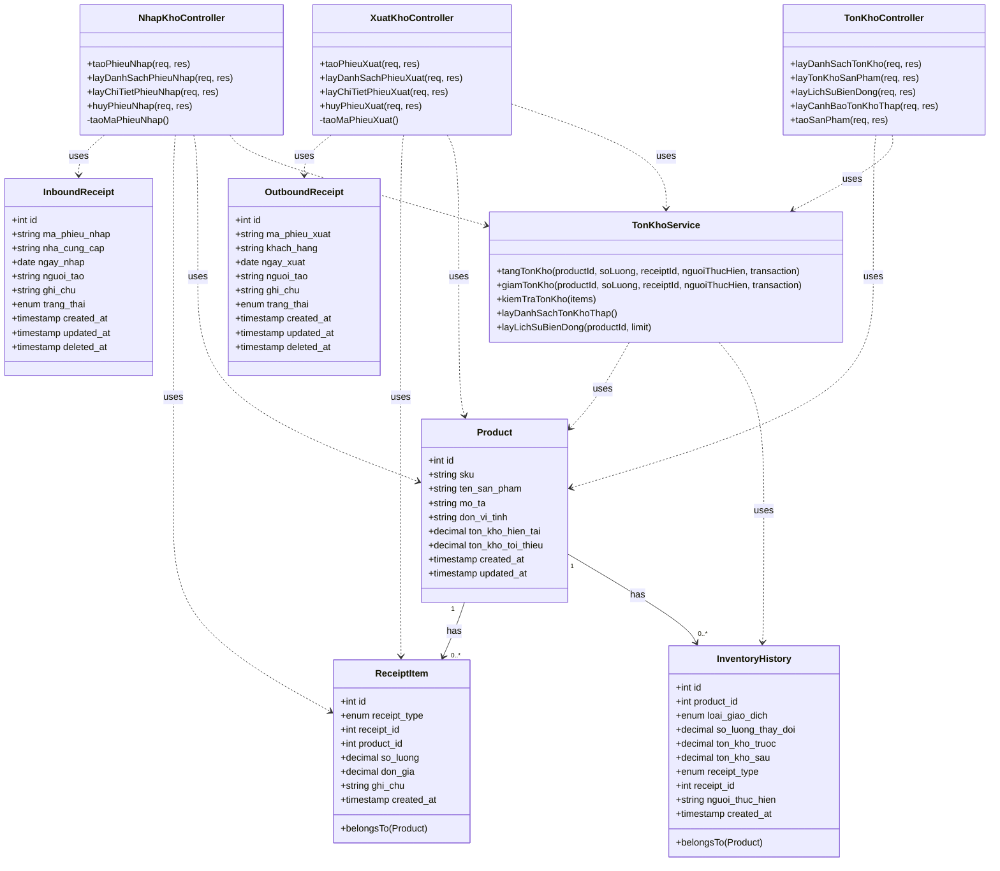
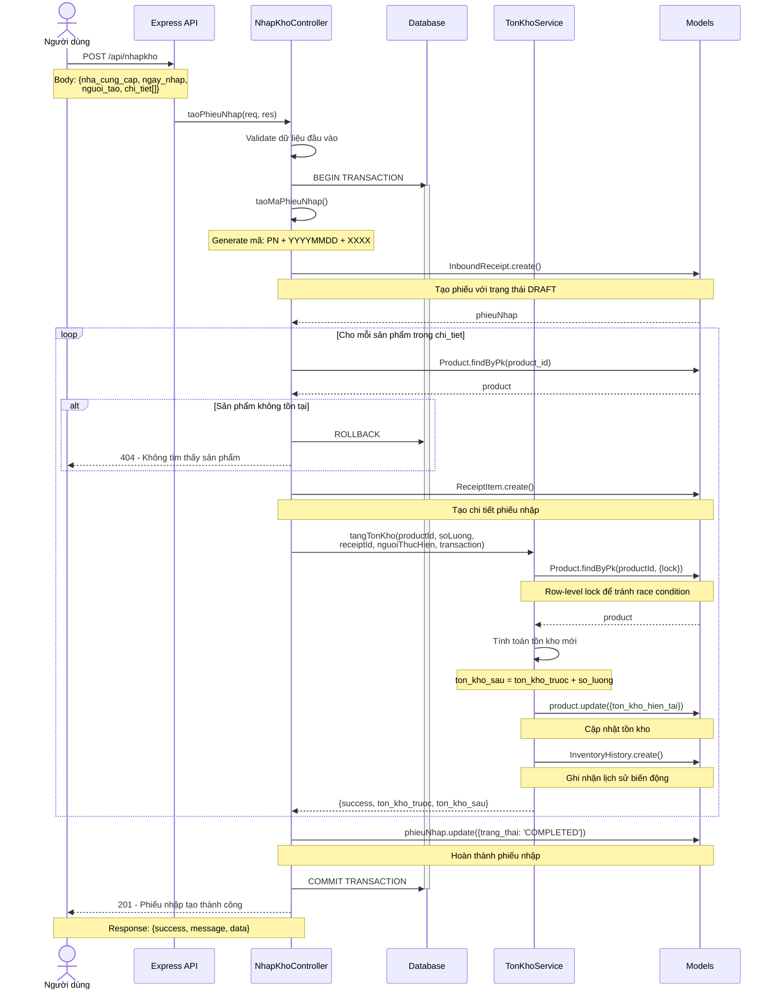
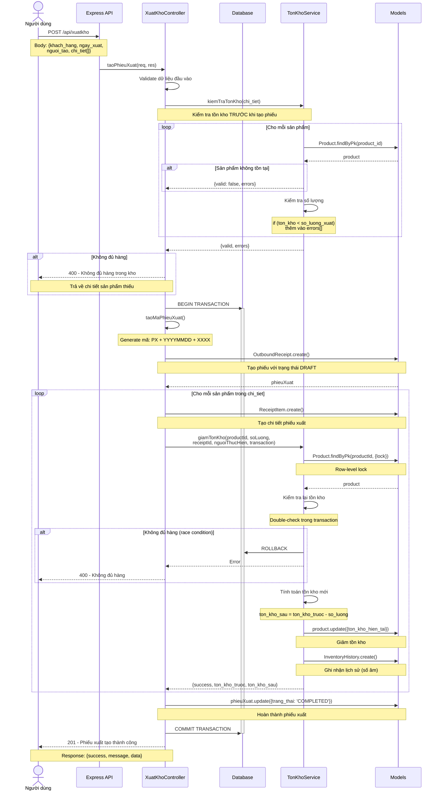
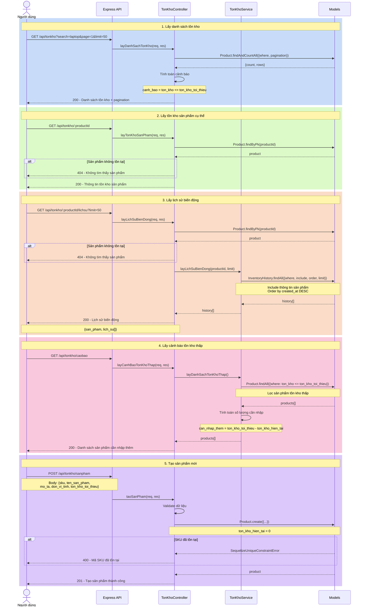

# Sơ Đồ Mermaid - Inoutbound Service

Tài liệu này chứa các sơ đồ Mermaid cho hệ thống quản lý nhập xuất kho.

## 1. ERD (Entity Relationship Diagram)

Sơ đồ quan hệ thực thể mô tả cấu trúc database của hệ thống.

## 2. Class Diagram

Sơ đồ lớp mô tả cấu trúc các class trong hệ thống.

## 3. Sequence Diagram - Tạo Phiếu Nhập Kho

Sơ đồ tuần tự mô tả luồng nghiệp vụ tạo phiếu nhập kho.

## 4. Sequence Diagram - Tạo Phiếu Xuất Kho

Sơ đồ tuần tự mô tả luồng nghiệp vụ tạo phiếu xuất kho với kiểm tra tồn kho.

## 5. Sequence Diagram - Quản Lý Tồn Kho

Sơ đồ tuần tự mô tả các chức năng truy vấn tồn kho.

---

## Tổng Quan Kiến Trúc

### Các Thành Phần Chính

1. **Models (Sequelize ORM)**
   - `Product`: Quản lý thông tin sản phẩm và tồn kho
   - `InboundReceipt`: Phiếu nhập kho
   - `OutboundReceipt`: Phiếu xuất kho
   - `ReceiptItem`: Chi tiết phiếu (dùng chung cho nhập/xuất)
   - `InventoryHistory`: Lịch sử biến động tồn kho

2. **Controllers**
   - `NhapKhoController`: Xử lý API nhập kho
   - `XuatKhoController`: Xử lý API xuất kho
   - `TonKhoController`: Xử lý API truy vấn tồn kho

3. **Services**
   - `TonKhoService`: Logic nghiệp vụ tồn kho (tăng/giảm, kiểm tra, lịch sử)

### Đặc Điểm Kỹ Thuật

- **Transaction Support**: Tất cả thao tác nhập/xuất sử dụng database transaction
- **Row-Level Locking**: Tránh race condition khi cập nhật tồn kho đồng thời
- **Soft Delete**: Phiếu nhập/xuất hỗ trợ xóa mềm (paranoid)
- **Audit Trail**: Ghi nhận đầy đủ lịch sử biến động tồn kho
- **Validation**: Kiểm tra tồn kho trước khi xuất hàng
- **Auto-generated Code**: Mã phiếu tự động theo format PN/PX + YYYYMMDD + XXXX
